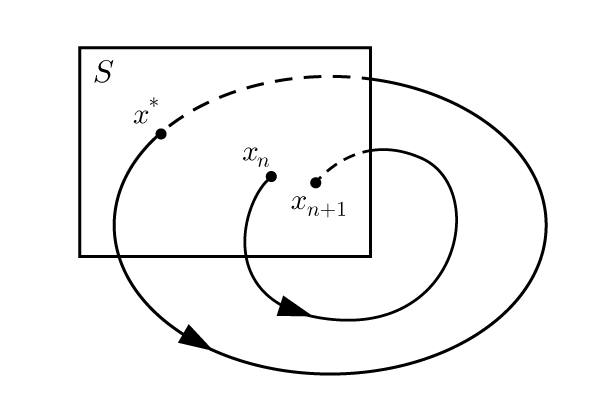

# ポアンカレ写像

歩⾏・⾛⾏運動は周期的であるため，研究においてしばしば**周期解**を求める．
ベクトル場（流れを持つ場）における周期軌道を調べるにあたって，ポアンカレ写像を考えることが便利である．

$D$次元の系$\dot{x}=f(x)$を考えよう．$S$を$D-1$次元の断面とする．$S$が流れに横断的であること，つまり，$S$から出発する全ての軌道が，$S$と平行となることなく$S$を貫いて流れることが必要である．このような断面$S$を**ポアンカレ断面**という．

    

ポアンカレ写像$P$は，$S$からそれ自身への写像で，軌道と$S$が交わる点から出発して，次に軌道が$S$が交わるまで軌道を追跡することで得られる．もし$x_n$が$n$番目の交点なら，ポアンカレ写像は
$$
    x_{n+1} = P(x_n)
$$
で定義される．

**問．写像とは何か，簡潔に説明せよ．**

軌道が周期的であれば，その軌道とポアンカレ断面の交点$x^*$から出発して再びポアンカレ断面に戻ると，
$$
    x^* = P(x^*)
$$
が成立する．このような点$x^*$をポアンカレ写像の**固定点**という．

このように，ポアンカレ写像は，（一般には難しい）閉軌道についての問題を，（実際上は必ずしも易しいとは限らないが，原理的にはより易しい）写像の固定点についての問題に変換する．その障害となるのは，通常は$P$の公式を求めるのが不可能であるという点である．実際の応用では，数値シミュレーションなどを通して$P$を算出する．

## 周期軌道の線形安定性

    

閉軌道を持つ$\dot{x}=f(x)$が与えられたとき，その閉軌道から少しずれた点から始まる軌跡の挙動を考える．軌跡がやがて閉軌道に吸い寄せられ，収束していくとき，その閉軌道は**安定**であるという．逆に，ずれた点から始まった軌跡が閉軌道から遠ざかっていくとき，閉軌道は**不安定**である．

軌道が安定であるか，不安定であるかは，閉軌道に対応するポアンカレ写像の固定点$x^*$が安定かどうかに対応している．すなわち，無限小の摂動$v_0$を，$x^*+v_0$が$S$上にあるように加え，ポアンカレ写像を施したとき，摂動が縮小すれば安定，拡大すれば不安定である．

再びポアンカレ断面上に戻ってきたときの摂動を$v_1$として，テイラー展開により以下が成立する．
$$
x^* + v_1   = P(x^*+v_0) = P(x^*) + J(x^*) v_0 + O(||v_0||^2)
$$
ここで，ヤコビ行列$J(x^*)\in\mathbb{R}^{(D-1)\times(D-1)}$は$x^*$における**線形化したポアンカレ写像**と呼ばれる．

**問．1次元のテイラー展開について説明せよ．**
**問．ヤコビ行列はベクトル関数$P$をベクトル$x$で偏微分して得られる．この行列の要素を書き下せ．**

$x^*$は固定点なので，$x^*=P(x^*)$が成立することから，
$$
v_1 = J(x^*)v_0
$$
を得る．ここで，$O(||v_0||^2)$の小さな項を無視できると仮定している．

安定性は，$J(x^*)$の固有値$\lambda_j$を用いて表現される．すなわち，**閉軌道は，全ての$j=1,\cdots,n-1$に対して$|\lambda_j|<1$である場合に限り，線形安定である．**
これを理解するため，固有値に重複がない場合を考えよう．すると，$J(x^*)$の固有ベクトル$\{e_j\}$からなる基底があり，何らかのスカラー$\nu_j$を用いて$v_0 = \sum_{j=1}^{n-1}\nu_j e_j$と書くことができる．ゆえに，
$$
    v_1 = J\sum_{j=1}^{n-1}\nu_j e_j = \sum_{j=1}^{n-1}\nu_j \lambda_j e_j
$$
が成立する．ここで$J=J(x^*)$と略記した．

**問．ある行列$A$の固有値と固有ベクトルとは何か，説明せよ．**

**問．ベクトル空間の基底とは何か，説明せよ．**

線形写像を$k$回繰り返すと，
$$
v_k = \sum_{j=1}^{n-1}\nu_j (\lambda_j)^k e_j
$$
となる．したがって，もし全ての$j$について$|\lambda_j|<1$ならば，$k\rightarrow\infty$の極限で$||v_k||\rightarrow 0$となる．すなわち，このとき$x^*$は安定である．
逆に，もしいずれかの$j$に対して$|\lambda_j|>1$ならば，$e_j$方向に摂動は成長し，$x^*$は不安定である．

## 参考文献

S.ストロガッツ，「非線形ダイナミクスとカオス」，丸善出版，2015．