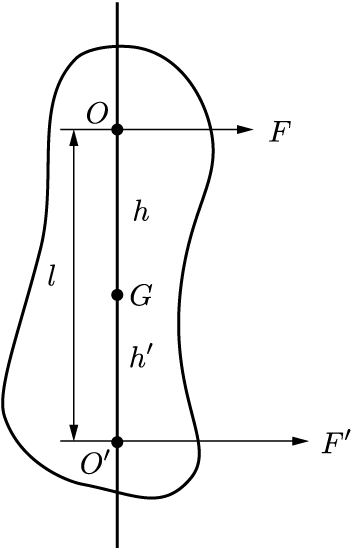

# 剛体の衝突力学（平面）

剛体に撃力が加えられると，並進速度の変化だけでなく角速度の変化も発生する．この関係についてまとめる．

## 慣性モーメント

    

ある軸まわりの剛体の慣性モーメントを求めると，
$$
    I = \sum_i m_i r_i^2
$$
となる．ここで，$m_i$は軸から$r_i$離れた位置にある，剛体の微小分割．
これをさらに細かく分割して，微小体積$dV$の積分として表すと
$$
    I = \int \rho r^2 dV
$$
となる．ここで$\rho$は剛体の密度を表す．

### 剛体の回転

剛体に対して，軸回りにトルク$N$をかけたとき，剛体の角運動量$L$について以下が成立する．
$$
    \frac{{\rm d}L}{{\rm d}t} = I\ddot{\theta} =N
$$
ここで，$\theta$は剛体が軸となす角度．
外からトルクが加えられていない状況では，
$$
    \frac{{\rm d}L}{{\rm d}t} =0
$$
となり，$L$は一定となる．これを**角運動量保存則**という．
（概念を拡張して，$N\neq 0$のときも角運動量保存則と呼んだりする．）

### 慣性半径

**慣性半径 (Radius of Gyration)**$R$という量を定義すると便利なことがある．
$$
    MR^2 = I
$$
これは，剛体の質量$M$が，慣性モーメントを変えることなく軸から$R$の距離に集まっていると考えることができる．

### 平行軸の定理

ある軸周りの慣性モーメントが$I$であるとき，そこから$r$離れた軸回りの慣性モーメントは
$$
    I' = I + Mr^2
$$
となる．

## シンプルな振り子（準備）

質点$m$が長さ$l$の糸で点$O$から吊るされている．鉛直方向と振り子のなす角度を$\theta$とする．この系の$O$周りの慣性モーメントは
$$
I = ml^2
$$
であり，重力が及ぼすトルクは
$$
N = -mgl\sin\theta
$$
である．
したがって，角運動量保存則から
$$
\ddot{\theta} = -\frac{g}{l}\sin\theta
$$
となる．

## 剛体振り子

    

固定された軸が質量中心を通らないような質量$M$の剛体振り子を考える．
剛体の固定点と質量中心を通る直線が鉛直方向となす角度を$\theta$とする．
この振り子の運動方程式は
$$
MR_O^2\ddot{\theta} = -Mgh\sin\theta
$$
ここで，$h$は距離$\bar{OG}$であり，$R_O$は$O$を軸とした慣性半径である．
この運動方程式は，
$$
l = \frac{R_O^2}{h}
$$
としたとき，質量$M$の質点のシンプルな振り子の運動方程式と一致する．
すなわち，質量$M$が半直線$OG$上の$O$から$l$離れた点$O'$に集まったときの振動が，剛体振り子の振動と一致する．
$$
l = h + h'
$$
$$
hh' = R_O^2 - h^2
$$
を満たすとき，点$O'$を**振動中心(center of oscillation)** と呼ぶ．

$G$まわりの慣性半径を$R_G$とすると，平行軸の定理から
$$
R_O^2 = R_G^2 + h^2
$$
となる．これを用いると，
$$
hh' = R_G^2
$$
が成立する．
この式は$h$と$h'$に関して対称である（すなわち，$h$と$h'$が入れ替わっても成立）．
すなわち，点$O'$を軸とした剛体振り子を作ると，その振動中心は$O$となる．

## 剛体に撃力を加える

    

点$O$を軸として固定された剛体振り子を考える．
軸から$l$離れた位置にある点$O'$に撃力を加える．
撃力は直線$\bar{OO'}$に垂直な向きを向いているとする．
$O'$が，直線$\bar{OO'}$が質量中心$G$を通るとして，$h$と$h'$をそれぞれ距離$\bar{OG}$，$\bar{OG'}$とする．
点$O'$に加えられた撃力は
$$
J' = \int F' {\rm d}t
$$
である．このとき，点$O$では，固定された軸が動かないように撃力$J$が発生する．
$$
J = \int F {\rm d}t
$$
剛体の（線）運動量変化は
$$
\frac{{\rm d}P}{{\rm d}t} = \frac{{\rm d}}{{\rm d}t}(Mh\dot{\theta}) = F+F'
$$
である．ここで，$\dot{\theta}$は剛体の$O$周りの角速度．
これを積分して，撃力による運動量の変化は
$$
Mh\dot{\theta} = J+J'
$$
となる．ただし，剛体は撃力を加える前は静止していたものとした．
$O$周りの角運動量保存則は，
$$
\frac{{\rm d}L}{{\rm d}t} = \frac{{\rm d}}{{\rm d}t}(MR_O^2\dot{\theta}) = F'l
$$
であり，これを積分して
$$
MR_O^2\dot{\theta} = J'l
$$
を得る．
以上の結果を用いて$\dot{\theta}$を消去すると，
$$
hl = R_O^2\left(1+\frac{J}{J'}\right)
$$
となる．

ここで，$O'$をいい感じの場所にとって，$J=0$とすることを考えよう．このとき，$h$と$l$の関係は
$$
hl = R_O^2
$$
となる．
$l = h + h'$と，$R_O^2 = R_G^2 + h^2$から
$$
hh' = R_G^2
$$
という関係が得られる．
点$O'$に撃力を加えたとき，点$O$では角速度変化が一切生じない．
このような点$O$を，**撃力中心(Center of percussion)** と呼ぶ．
撃力中心と振動中心が同じ点であることに注意しよう．

剛体が固定されておらず，撃力中心$O'$に撃力が加えられたとき，その直後の運動は$O$周りの回転となる．

このような点は，野球でバットを振る場合などに有効である．
球を打ち返すときに，撃力中心に当てるようにすれば，回転中心である手に返ってくる力はゼロとなる．

## Reference

K. Symon, "Mechanics", Addison-Wesley Publishing, 1971.