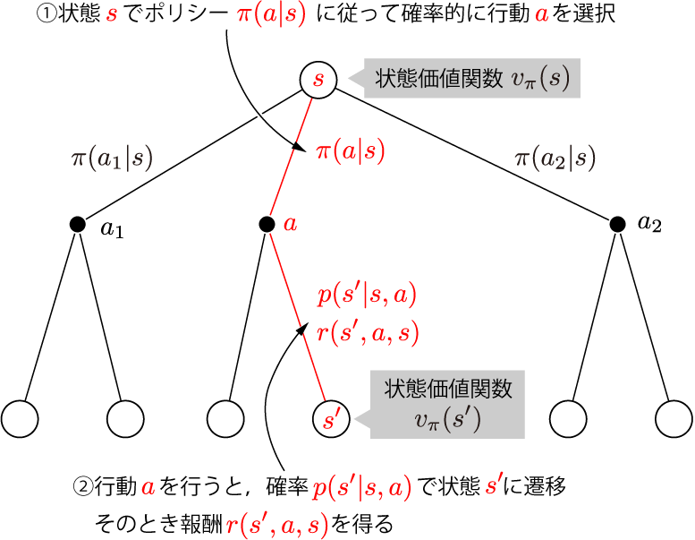

Sutton強化学習まとめPart1

- [1. Introduction](#1-introduction)
  - [1.1. Reinforcement learning](#11-reinforcement-learning)
  - [1.2. Elements of reinforcement learning](#12-elements-of-reinforcement-learning)
- [2. Bandit Problems](#2-bandit-problems)
  - [2.1. $n$-armed bandit problem](#21-n-armed-bandit-problem)
- [3. The reinforcement learning problem](#3-the-reinforcement-learning-problem)
  - [3.1. The agent-environment interface](#31-the-agent-environment-interface)
  - [3.2. Goals and rewards](#32-goals-and-rewards)
  - [3.3. Returns](#33-returns)
  - [3.4. Unified notation for episodic and continuing tasks](#34-unified-notation-for-episodic-and-continuing-tasks)
  - [3.5. The Markov property](#35-the-markov-property)
  - [3.6. Markov decision process (MDP)](#36-markov-decision-process-mdp)
  - [3.7. Value functions](#37-value-functions)
  - [3.8. Optimal value functions](#38-optimal-value-functions)

# 1. Introduction

## 1.1. Reinforcement learning

- 数値化された報酬を最大にするために，何をすべきかを学習．
- 試行錯誤的な探索と，遅延する（即時的でない）報酬
- ゴール（目標）を達成するために，環境と相互作用するエージェントを扱う
- exploration-exploitation トレードオフ
  - 良い報酬を得るために，これまでの探索結果を活用したい
  - より良い報酬を得るために，これまでと違う方法を試したい

## 1.2. Elements of reinforcement learning

- 方策(Policy)
  - 現在の状態と行動を結びつける関数
- 報酬(Reward)
  - 学習で最大化すべき目標
  - 現在の状態のみから得られる
- 価値(Value)
  - 最終的に何が良いのか
  - 意思決定に用いられる
  - 報酬をもとに決定．決めるのは難しい
  - 遺伝的アルゴリズムなど，価値を用いない学習もある
- モデル
  - 将来の状態を予測する
  - プランニングに用いられる

# 2. Bandit Problems

## 2.1. $n$-armed bandit problem

- 例題：$n$本の腕を持つスロットマシーンを考える
- それぞれの腕は確率的に「当たり」を出し，確率には個体差がある
- ある時間区間においてトータルの報酬を最大とする腕を探そう
- 価値：行動を選択したとき，報酬の期待値
- Greedy：今まで知っている中で最も良い行動だけを取り続ける
- Greedyでない行動をたまに選ぶと，より良い報酬が得られるようになるかも

# 3. The reinforcement learning problem

## 3.1. The agent-environment interface

- Agent: 意思決定を行う（制御器）
- Environment: Agentの外側にあり，相互作用を行う
  - ロボットの身体は環境として捉えることに注意
- Policy $\pi_t(a|s)$: 状態$s$が得られたとき，行動$a$を選ぶ確率
- 強化学習とは，経験からポリシーを変更していくこと

## 3.2. Goals and rewards

- 報酬$R_t$の累積を最大化させよう（即時的なものではない）
- 報酬は環境から得られる．エージェントからは得られない
  - 環境とエージェントを適切なところで切り分けること

## 3.3. Returns

- 報酬の期待値$G_t$を最大化したい
  - $G_t = R_{t+1} + R_{t+2} + \cdots +R_T$
- エージェントと環境の相互作用は一連の行動（エピソード）に切り分けられる
- 割引率$\gamma$：エピソードに切り分けられないとき，報酬が無限大に発散しないように割引する
  - $0<\gamma<1$
  - $G_t = R_{t+1} + \gamma R_{t+2} + \gamma^2 R_{t+2} + \cdots$

## 3.4. Unified notation for episodic and continuing tasks

- エピソードが終わった後の報酬を全部ゼロにすれば，エピソード的タスクも永遠に続くタスクも同じ報酬で表せる．
- エピソード的ならば割引率は$\gamma=1$にしておく
$$
  G_t = \sum_{k=0}^{T-t-1} \gamma^k R_{t+k+1}
$$

## 3.5. The Markov property

- マルコフ性：それまでの経歴によらず，直前の状態だけで次の状態が決定する性質

## 3.6. Markov decision process (MDP)

- **マルコフ決定過程**：マルコフ性を満たす強化学習タスク
- ある時点で状態$s$に対して行動$a$をとる．次の状態$s'$が得られる**遷移確率**$p$は
$$
  p(s'|s,a) = {\rm Pr}\{S_{t+1}=s'|S_t=s, A_t=a\}
$$
- 次の状態$s'$で得られる報酬の期待値$r$は
$$
  r(s,a,s') = E[R_{t+1}|S_t=s, A_t=a, S_{t+1}=s']
$$

## 3.7. Value functions

- ポリシー$\pi(a|s)$は，状態$s$が得られたとき，行動$a$を行う確率
- **状態価値関数**$v_\pi(s)$は状態$s$から始めて，$\pi$に従ったとき，その後全部の報酬の期待値（報酬$G_t$や$R_t$は確率変数）
$$
  v_\pi(s) = E_\pi[G_t|S_t=s] = E_\pi\left[\sum_{k=0}^\infty\gamma^k R_{t+k+1} | S_t=s \right]
$$
- **行動価値関数**$q_\pi(s,a)$は
$$
  q_\pi(s) = E_\pi[G_t | S_t=s, A_t = a]
$$

- **Bellman方程式**
  - $s$に対して行動$a$は**確率的に選択**される（$\pi(a|s)$に従う）
  - 次の状態$s'$は（何通りか存在し）**確率的に遷移**する
    - 流れはバックアップ線図を見るとわかりやすい
  - 状態$s$が得られた時点から，次の状態$s'$に移るときに報酬$R_{t+1}$を得る
  - $s'$以降に得られる価値は$v_\pi(s')$
  - $v_\pi(s)$と$v_\pi(s')$の関係（Bellman方程式）は
$$
  v_\pi(s) = E_\pi[G_t|S_t=s]\\
           = E_\pi\left[R_{t+1}+\gamma\sum_{k=0}^\infty \gamma^k R_{t+k+2}|S_t=s\right]\\
           =\sum_a \pi(a|s)\left\lbrace \sum_{s'}p(s'|s,a)\{r(s,a,s')+\gamma v_\pi(s')\} \right\rbrace
$$

    

## 3.8. Optimal value functions

- 強化学習タスクは，長時間で考えて，より多くの報酬を獲得できるポリシーを見つけること
- あるポリシー$\pi$が別のポリシー$\pi'$より優れている，すなわち$\pi \geq \pi'$となるための必要十分条件は，全ての$s\in\mathcal{S}$に対して$v_\pi(s)\geq v_{\pi'}(s)$となること
- 最適ポリシー$\pi_*$に対して，最適状態価値関数$v_*$は
$$
  v_*(s) = \max_\pi v_\pi(s)
$$

- 最適行動価値関数$q_*$は
$$
  q_*(s,a) = \max_\pi q_\pi(s,a)
$$

- Bellman最適方程式
  - 行動$a$に関して期待値を取るのではなく，最適な行動を取った場合のBellman方程式
$$
  v_*(s) = \max_a E[R_{t+1}+\gamma v_*(S_{t+1})|S_t=s, A_t=a]\\
  =\max_a \sum_{s'}p(s'|s,a)\left\lbrace r(s,a,s') + \gamma v_*(s') \right\rbrace
$$

- 有限MDPについては，Bellman最適方程式はポリシーに関わらず唯一解を持つ
- 環境（$r(s,a,s')$と$p(s'|s,a)$）が既知ならば，原理的には$v_*$を求めることが可能
  - 全ての場合について報酬をあらかじめ計算することは，実際問題としては計算負荷が高すぎる
  - 一般には強化学習問題では近似的に最適解を求める