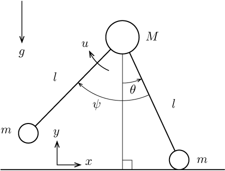

# コンパスモデルの運動方程式

コンパスモデルの運動方程式を求める．

## モデルの定義

最もシンプルなコンパスモデルを定義する．
モデルはヒップと2本の脚からなる．1本の脚は支持脚で，もう1本は遊脚である．脚の長さは$l$である．それぞれの足先にはタッチセンサーが取り付けられている．支持脚の足先は地面に拘束されていて，脚は足先周りに回転する．ヒップの質量$M$と脚の質量$m$がヒップと足先にそれぞれ取り付けられていると仮定し，モデルは$x$-$y$平面に拘束されているものとする．$x$は進行方向である．
このモデルは2つの自由度$\theta$と$\psi$を持つ．$\theta$は支持脚と鉛直方向のなす角度で，$\psi$は遊脚と支持脚のなす角度である．
重力加速度は$g$である．

モデルは遊脚を動かすトルク$u$を発生し，角度$\psi$を制御する．
このとき，角度$\theta$は直接制御されない．

    

### 片脚支持期

ヒップの位置を$(x_1,y_1)$，遊脚の足先位置を$(x_2,y_2)$とする．支持脚の足先位置を$(x_0,0)$とすると，
$$
x_1 = x_0 - l \sin \theta\\
y_1 = l\cos\theta\\
x_2 = x_1 + l\sin(\theta-\psi)\\
y_2 = y_1 - l\cos(\theta-\psi)
$$
となる．ここから，各質点の速度は
$$
\dot{x}_1 = -l\dot{\theta}\cos\theta\\
\dot{y}_1 = -l\dot{\theta}\sin\theta\\
\dot{x}_2 = \dot{x}_1 + l(\dot{\theta}-\dot{\psi})\cos(\theta-\psi)\\
\dot{y}_2 = \dot{y}_1 + l(\dot{\theta}-\dot{\psi})\sin(\theta-\psi)
$$
である．

運動エネルギー$T$とポテンシャルエネルギー$U$からラグランジアン$L$を求める．
$$
T = \frac{M}{2}(\dot{x}_1^2+\dot{y}_1^2)+\frac{m}{2}(\dot{x}_2^2+\dot{y}_2^2)\\
U = Mgy_1+mgy_2\\
L = T-U
$$
ラグランジュの運動方程式は，$q=[\theta_1 \theta_2]^\top$として，
$$
\mathcal{M}(q)=\frac{\partial}{\partial \dot{q}}\left( \frac{\partial L}{\partial \dot{q}} \right) = \begin{bmatrix}
    (M+2m(1-\cos\psi))l^2   &-ml^2(1-\cos\psi)\\
    -(1-\cos\psi)ml^2   &ml^2
\end{bmatrix}\\
\mathcal{H}(q,\dot{q})+\mathcal{G}(q)=\frac{\partial}{\partial q}\left(\frac{\partial L}{\partial \dot{q}}\right) - \frac{\partial L}{\partial q} = \begin{bmatrix}
    ml^2(2\dot{\theta}\dot{\psi}-\dot{\psi}^2)\sin\psi - (M+m)gl\sin\theta + mgl \sin (\theta-\psi)\\
    -ml^2\dot{\theta}^2\sin\psi - mgl\sin(\theta-\psi)
\end{bmatrix}
$$
を用いて
$$
\mathcal{M}(q)\ddot{q} + \mathcal{H}(q,\dot{q})+\mathcal{G}(q)=\begin{bmatrix}
    0\\
    u
\end{bmatrix}
$$
と表せる．
ちなみにコリオリ・遠心力$\mathcal{H}(q,\dot{q})$とポテンシャル力$\mathcal{G}(q)$は以下のように分解される．
$$
\mathcal{H}(q,\dot{q})= \begin{bmatrix}
    ml^2(2\dot{\theta}\dot{\psi}-\dot{\psi}^2)\sin\psi\\
    -ml^2\dot{\theta}^2\sin\psi
\end{bmatrix}\\
\mathcal{G}(q)= \begin{bmatrix}
    - (M+m)gl\sin\theta + mgl \sin (\theta-\psi)\\
    - mgl\sin(\theta-\psi)
\end{bmatrix}
$$

### 両脚支持期

遊脚は，接地条件$r(q)=0$を満たすと接地する．ここで，
$$
    r(q) = 2\theta-\psi
$$
である．

両脚支持期は限りなく短いと仮定する．すなわち，接地した瞬間，支持脚の拘束は解除され，離床する．
この仮定から，遊脚の足先で撃力が発生し，角速度に不連続な変化が起きる．
さらに，支持脚は地面と相互作用なく離床し，また，アクチュエータは短い両脚支持期においてその影響が無視できるものとする．

衝突の前後では，足先の拘束が解除されるので，その拘束を考慮しない運動方程式を立て直す必要がある．
状態変数は$q_e = [\theta_1 \theta_2 x_0 y_0]^\top$と変更され，質点の位置は
$$
    x_1 = x_0 - l \sin \theta\\
    y_1 = y_0 + l\cos\theta\\
    x_2 = x_1 + l\sin(\theta-\psi)\\
    y_2 = y_1 - l\cos(\theta-\psi)
$$
となる．質点の速度は
$$
    \dot{x}_1 = \dot{x}_0 - l\dot{\theta}\cos\theta\\
    \dot{y}_1 = \dot{y}_0 - l\dot{\theta}\sin\theta\\
    \dot{x}_2 = \dot{x}_1 + l(\dot{\theta}-\dot{\psi})\cos(\theta-\psi)\\
    \dot{y}_2 = \dot{y}_1 + l(\dot{\theta}-\dot{\psi})\sin(\theta-\psi)
$$
ここから，エネルギーを求め直すと
$$
T_e = \frac{m}{2}(\dot{x}_0^2+\dot{y}_0^2)\frac{M}{2}(\dot{x}_1^2+\dot{y}_1^2)+\frac{m}{2}(\dot{x}_2^2+\dot{y}_2^2)\\
U_e = mgy_0J+Mgy_1+mgy_2\\
L_e = T-U
$$
ラグランジュの運動方程式は，$q=[\theta_1 \theta_2]^\top$として，
$$
\mathcal{M}_e(q_e)=\frac{\partial}{\partial \dot{q}_e}\left( \frac{\partial L_e}{\partial \dot{q}_e} \right) = \begin{bmatrix}
    (M+2m(1-\cos\psi))l^2   &-ml^2(1-\cos\psi)\\
    -(1-\cos\psi)ml^2   &ml^2
\end{bmatrix}\\
\mathcal{H}_e(q_e,\dot{q}_e)+\mathcal{G}_e(q_e)=\frac{\partial}{\partial q_e}\left(\frac{\partial L_e}{\partial \dot{q}_e}\right) - \frac{\partial L_e}{\partial q_e}
$$
を用いて
$$
\mathcal{M}_e(q_e)\ddot{q_e} + \mathcal{H}_e(q_e,\dot{q}_e)+\mathcal{G}_e(q_e)=\delta F^{\rm ext}
$$
と表せる．$\delta F^{\rm ext}$は遊脚の足先に発生する撃力である．

運動方程式を衝突の瞬間の微小時間で積分すると以下の運動量保存則を得る．
$$
\mathcal{M}_e(q_e)(\dot{q}_e^+ - \dot{q}_e^-) = F^{\rm ext}
$$
である．ここで，$*^-$と$*^+$はそれぞれ衝突の直前と直後の状態量であることを示す．
足先で発生する撃力は水平方向に$F_T$，鉛直方向に$F_N$とおくと，
$$
    F^{\rm ext} = J^\top F= J^\top \begin{bmatrix}
        F_T\\
        F_N
    \end{bmatrix}
$$
と表せる．ここでヤコビ行列$J$は，
$$
J = \frac{\partial q_2}{\partial q_e}=\frac{\partial}{\partial q_e}\begin{bmatrix}
    x_2\\
    y_2
\end{bmatrix}=\begin{bmatrix}
    -l\cos\theta + l\cos(\theta-\psi) & -\cos(\theta-\psi) & 1 & 0\\
    -l\sin\theta + l\sin(\theta-\psi) & -\sin(\theta-\psi) & 0 & 1
\end{bmatrix}
$$
である．

遊脚の足先は衝突した直後に地面に拘束されることから，
$$
J \dot{q}^+ = 0
$$
が成立する．

運動量保存則と衝突直後の拘束式をまとめて解くと，衝突直後の速度と撃力を得る．すなわち，
$$
\begin{bmatrix}
    \mathcal{M}_e(q_e) & -E^\top\\
    E & 0
\end{bmatrix}
\begin{bmatrix}
    \dot{q}_e^+\\
    F
\end{bmatrix}=\begin{bmatrix}
    \mathcal{M}_e(q_e)\dot{q}_e^-\\
    0
\end{bmatrix}
$$
を解けばよい．
この方程式が解を持つのは
$$
A = \begin{bmatrix}
    \mathcal{M}_e(q_e) & -E^\top\\
    E & 0
\end{bmatrix}
$$
が逆行列を持つときであり，$\det A >0$が示せるため，それは常に存在する．
したがって，
$$
\begin{bmatrix}
    \dot{q}_e^+\\
    F
\end{bmatrix}=A^{-1}\begin{bmatrix}
    \mathcal{M}_e(q_e)\dot{q}_e^-\\
    0
\end{bmatrix}
$$
を得る．
さらに，衝突条件$\psi=2\theta$と，$\dot{x}_0^-=\dot{y}_0^-=0$であることから，衝突前後の状態量の関係は以下のように表せる．
$$
\begin{bmatrix}
    \theta^+\\
    \psi^+\\
    \dot{\theta}^+\\
    \dot{\psi}^+
\end{bmatrix}=
\begin{bmatrix}
    -\theta^-\\
    -\psi^-\\
    \frac{2\cos(2\theta^-)}{2+\beta(1-\cos4\theta^-)}\dot{\theta}^-\\
    \frac{2(1-\cos2\theta^-)\cos 2\theta^-}{2+\beta(1-\cos4\theta^-)}\dot{\theta}^-
\end{bmatrix}
$$
ここで，$\beta=m/M$である．
## 参考文献
[1] J. Grizzle, G. Abba, and F. Plestan, "Asymptotically stable walking for biped robots: analysis via systems with impluse effects", IEEE Trans. Automat. Contr., 46(1):51--64, 2001.
[2] S. Aoi and K. Tsuchiya, "Self-stability of a simple walking model driven by a rhythmic signal", Nonlinear Dyn., 48:1--16, 2007.