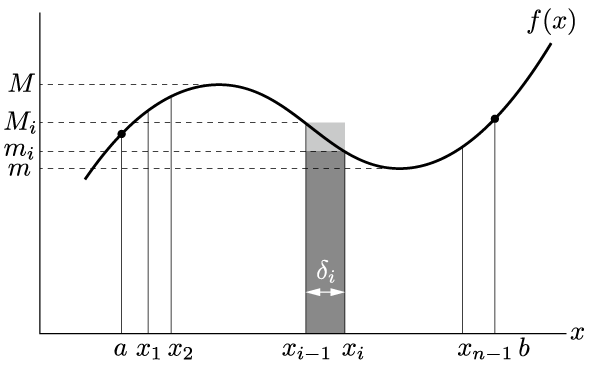
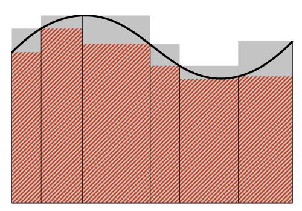

# 積分

積分を定義する．積分可能条件とは？

## 区間の分割

    

区間$[a,b]$において関数$f(x)$は有界とする．
この区間を$x_1,x_2, \cdots, x_{n-1}$において$n$個の細区間に分割する．
$$
    a < x_1 < x_2 < \cdots < x_{n-1} < b
$$
この分割を$\Delta$と名付ける．
$\Delta$において，左から$i$番目の区間の幅を$\delta_i$とする．すなわち，
$$
\delta_i = x_i - x_{i-1} > 0
$$
ただし$\delta_1 = x_1-a$, $\delta_n =b-x_{n-1}$とする．

$\delta_i$のうち，最大のものを$\delta$とする．
区間$\delta_i$における$f(x)$の値の上限，下限をそれぞれ$M_i, m_i$とする．
全区間$[a,b]$の上限，下限は$M,m$とする．したがって，
$$
    M_i \leq M, \ m_i \geq m
$$

ここで，次のような和を考えてみる．
$$
S_\Delta = \sum_{i=1}^n M_i \delta_i\\
\ s_\Delta = \sum_{i=1}^n m_i \delta_i
$$
$m_i<M_i$なので，
$$
    s_\Delta \leq S_\Delta
$$
が成立する．
また，
$$
    S_\Delta \leq M \sum_{i=1}^n \delta_i = M(b-a)\\
    s_\Delta \geq m \sum_{i=1}^n \delta_i =m(b-a)
$$
だから，
$$
m(b-a)\leq s_\Delta \leq S_\Delta \leq M(b-a)
$$
が成立する．したがって，すべての分割法$\Delta$に対して$s_\Delta$も$S_\Delta$も有界．

分割$\Delta$の各区間をさらに細分化して分割$\Delta'$を作る．このとき，
$$
    s_\Delta \leq s_{\Delta'}\\
    S_{\Delta'} \leq S_{\Delta}
$$
となる．

$\Delta$と$\Delta'$を任意の2つの分割法として，$\Delta$に対応する$s_\Delta$と，$\Delta'$に対応する$S_{\Delta'}$を比較する．
$\Delta$と$\Delta'$の分点をあわせて更に細かい分割$\Delta''$を作ると，
$$
    s_\Delta \leq s_{\Delta''}\\
    S_{\Delta''} \leq S_{\Delta'}
$$
となり，ここから
$$
    s_\Delta \leq s_{\Delta''} \leq S_{\Delta''} \leq S_{\Delta'}
$$
が得られる．したがって，**任意の**分割$\Delta$と$\Delta'$に対して
$$
    s_{\Delta} \leq S_{\Delta'}
$$
が成立する．
ここから，左辺の上限$s$と右辺の下限$S$について
$$
    s\leq S
$$
が成立する．

### 区間分割と面積

    

赤色網掛け部が$s_\Delta$であり，灰色塗りつぶし部が$S_\Delta$である．
この図において$f(x)$のグラフが面積$I$が確定であれば，$s_\Delta \leq I \leq S_\Delta$であり，区間を限りなく細かく取ることで$s_\Delta$が下から，$S_\Delta$が上から限りなく$I$に近づくだろう．

## 原始関数

区間$[a,b]$の部分区間$[a',b']$に関する和$\sum_i M_i\delta_i$の下限を$S(a', b')$と書くことにする．このとき，
$$
    S(a,b) = S(a,x) + S(x,b)
$$
が成立する．
ここから，$h>0$とすれば，
$$
    S(a,x+h) - S(a, x) = S(x, x+h)
$$
であるが，$[x,x+h]$における$f(x)$の上限と下限を$M_0, m_0$とすれば，
$$
    m_0h \leq S(x,x+h) \leq M_0h
$$

## 積分可能

$s=S$の場合，分割$\Delta$に関して各細区間$[x_{i-1},x_i]$において任意の点$\xi$を取って，和
$$
    \Sigma_\Delta = \sum_{i=1}^{n}f(\xi_i)\delta_i
$$
を作れば，$s_\Delta \leq \Sigma_\Delta \leq S_\Delta$となる．

$\delta \rightarrow 0$のとき，分割$\Delta$と$\xi$の選択に無関係に$\Sigma_\Delta$の極限が存在して，それが$I$である．
$$
    I = \lim_{\delta \rightarrow 0} \sum_i f(\xi_i)\delta_i
$$
この極限値$I$を区間$[a,b]$における$f(x)$の定積分といい，
$$
    I = \int_a^b f(x){\rm d}x
$$
と表す．

極限値$I$が存在するとき，$f(x)$は区間$[a,b]$において積分可能であるという．
$s=S$は積分可能の十分条件である．

## 積分不可能な関数

例えば，3次元空間に浮かんでいる剛体の角速度$\omega$を定義する．
$\omega$をどのように積分しても，剛体の姿勢にはならない．

## Reference

高木貞治，「定本　解析概論」，岩波書店，2010．