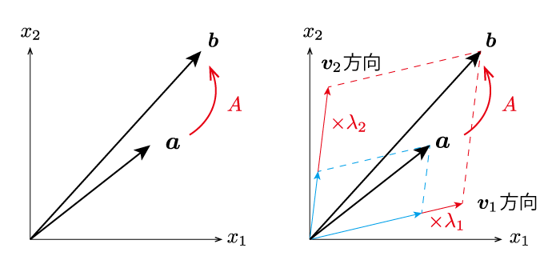

# 線形代数の大事なこと <!-- omit in toc -->

- [1. ベクトル空間](#1-ベクトル空間)
  - [1.1. ベクトル空間とベクトルの定義](#11-ベクトル空間とベクトルの定義)
  - [1.2. 基底](#12-基底)
- [2. 写像](#2-写像)
  - [2.1. 写像の定義](#21-写像の定義)
  - [2.2. 線形写像](#22-線形写像)
- [3. 固有値と固有ベクトル](#3-固有値と固有ベクトル)
  - [3.1. 定義](#31-定義)
  - [3.2. 線形写像を固有ベクトルで捉える](#32-線形写像を固有ベクトルで捉える)
- [4. 行列の対角化](#4-行列の対角化)

工学部に入ってはじめに学ぶ数学は，微分積分学と線形代数学の２つであることが多いと思います．
学部の線形代数学では特に，掃き出し法とか対角化のアルゴリズムを覚えて手計算を行えるようになることに尽力してしまい，結局何を学んだのかわからないままになっている方が多い印象があります．かくいう筆者もそのような学生の一人でした．
ここでは，細かい計算を抜きにして，最速で対角化の理論までたどり着き，**１年生の線形代数学で何を学んだのか**を整理してみようと思います．

本稿では，紙面の都合上，細かい用語の定義や，定理の証明は飛ばして自由に用いることにしますので，必要に応じて適宜線形代数の教科書を参照して下さい．

## 1. ベクトル空間

### 1.1. ベクトル空間とベクトルの定義

線形代数ではまず**ベクトル**を定義します．ここでベクトルとは，高校生で習った「向きと大きさを持つ量」というイメージを超えて，かなり抽象的な定義を行います．

まず，**ベクトル空間**を定義します．
ベクトル空間とは，以下のような性質をもつものの集合です．

1. $\bm{u}+\bm{v} = \bm{u}+\bm{v}$
2. $(\bm{u}+\bm{v})+\bm{w} = \bm{u}+(\bm{v}+\bm{w})$
3. $\bm{v}+\bm{0}=\bm{v}$となる元$\bm{0}$が存在する
4. $\bm{v}$に対して$\bm{v} + \bm{v'}=\bm{0}$となる元$\bm{v'}=-\bm{v}$が存在する
5. $c(\bm{u}+\bm{v}) = c\bm{u}+c\bm{v}$
6. $(c_1+c_2)\bm{v} = c_1 \bm{v} + c_2\bm{v}$
7. $(c_1c_2)\bm{v}  =c_1 (c_2\bm{v})$
8. $1\bm{v} = \bm{v}$

**ベクトルは，ベクトル空間の元（げん，集合の要素）** として定義します．
先に「ベクトル空間」が定義されるのが不思議ですね．
なお，性質1から4はベクトルどうしの演算について，5から8はベクトルとスカラーの演算についてを定義しています．
ベクトルどうしの掛け算や割り算は定義に含まれないことに注意しましょう．

ベクトル空間の定義から，4次元を超えるベクトルや複素ベクトルのように「大きさと向き」を定義しにくい量であっても，**上記の8つの性質を満たすのであれば，何でもベクトルとみなす**ということになります．
ただし，ここまでイメージを広げてしまうと，後の議論が大変です．基本的には高校数学のベクトルのようなものを例として考え，具体的なイメージも捉えておくのが良いでしょう．

なお本稿では，上記のように**ベクトルは太字**で，**スカラーは細字**で表すこととします．

### 1.2. 基底

いくつかのベクトル$\bm{a}_1, \bm{a}_2, \cdots, \bm{a}_n$をそれぞれスカラー倍して足し合わせて作られたベクトル
$$
c_1\bm{a}_1 + c_2\bm{a}_2+ \cdots+ c_n\bm{a}_n
$$
を，**線形結合**といいます．

$\bm{a}_1, \bm{a}_2, \cdots, \bm{a}_n$の間に
$$
c_1\bm{a}_1 + c_2\bm{a}_2+ \cdots+ c_n\bm{a}_n =0
$$
という関係が$c_1=\cdots=c_n=0$以外で成立するのであれば，$\bm{a}_1, \bm{a}_2, \cdots, \bm{a}_n$は**線形従属**といい，そうでないとき，**線形独立**であるといいます．

あるベクトル空間$V$の元で，線形独立な$\bm{e}_1,\cdots,\bm{e}_n$があるとします．$V$の任意の元$\bm{x}$が$\bm{e}_1,\cdots,\bm{e}_n$の線形結合
$$
\bm{x} = x_1 \bm{e}_1 + x_2 \bm{e}_2 + \cdots + x_n \bm{e}_n
$$
として表せるとき，$\bm{e}_1,\cdots,\bm{e}_n$を$V$の**基底**と呼びます．さらに，$V$の基底が$n$個の元からなるとき，$V$は$n$次元であるといいます．

## 2. 写像

### 2.1. 写像の定義

ある要素$a$に対して，（別の）ただ一つの要素$b$が，あるルールでによって対応づけられているとき，以下のように表記します．
$$
b = f(a)
$$
ここで，$f$を$a$から$b$への**写像**と呼びます．
高校数学で習う**関数**と似たものに見えますが，写像は関数を拡張したものであり，$a$が１次元のスカラーでなくてベクトルでも良いし，極端に言えば，連続に定義されていなくても構わないという特徴があります．例えば，$f$が引数のジャンルを表す写像と定義して，
$$
f(ねこ)=動物，f(おにぎり)=食べ物
$$
とすることも可能です．

逆に，一つの要素に対して複数のものが対応している場合，その対応ルールを写像と呼ぶことはありません．
例えば原点を中心とした単位円を考えてみましょう．ある$-1<x<1$に対して，その位置にある円周上の点は2つ存在するため，円周上の点の$x$座標に対応する$y$座標を写像と呼ぶことはできません．

### 2.2. 線形写像

写像の中で，以下のような特別な関係を満たすものを**線形写像**といいます．

1. $f(\bm{a}+\bm{b}) = f(\bm{a})+f(\bm{b})$
2. $f(c\bm{a}) = c f(\bm{a})$

このような等号が一般の写像に対して成り立たないことは，例えば一般に
$$
\sin(\theta_1+\theta_2) \neq \sin\theta_1+\sin\theta_2
$$
であることからも理解できるでしょう．

任意の線形写像$f$は，それに対応した**行列**$A$を用いて
$$
f(\bm{x}) = A\bm{x}
$$
と書き表せることが証明できます．

## 3. 固有値と固有ベクトル

行列$A$で定められる線形写像は，2つのベクトル$\bm{a}$と$\bm{b}:=A\bm{a}$を特定のルールで関連付けています．
$\bm{b}:=A\bm{a}$という関係から，$\bm{b}$は$\bm{a}$を一定のルールで**変換**したものと捉えることもできます．

例えば$\bm{a}$と$\bm{b}$が2次元平面上のベクトルであるときを考えてみましょう．
行列$A$がよほど特殊な形をしていない限り，「$\bm{b}$は$\bm{a}$の大きさと向きを変えたもの」であり，それ以上はっきりとした関係を見出すのは難しいように見えます．

    

この行列$A$が**正方行列**であるとき，すなわち変換前と変換後のベクトルの次元が変化しないとき，変換をわかりやすく説明することができるのが，以下で紹介する，固有値と固有ベクトルです．

### 3.1. 定義

ある特別なベクトル$\bm{v}$に対して，以下のような関係がたまたま成り立っていたとしましょう．
$$
A\bm{v} = \lambda \bm{v}
$$
すなわち，ベクトル$\bm{v}$に対して行列$A$による変換を施したとき，向きは一切変化せず，大きさだけが$\lambda$倍に変化したということになります．
このような$A$にとって特別なベクトルを，行列$A$の**固有ベクトル**といいます．また，倍率$\lambda$を行列$A$の**固有値**といいます．定義から，固有ベクトルと固有値は必ずセットで存在することになります．

固有ベクトルは，行列$A$の階数と同じだけ存在します．すなわち，$A$が$n\times n$の行列であったとき，（$A$がランク落ちしていない限り）$n$個の独立な固有ベクトルが存在することになります．

### 3.2. 線形写像を固有ベクトルで捉える

さて，一般に$n$次元のベクトルは，$n$個の独立なベクトルの線形和で表すことができることが示されています．この事実を用いると，任意のベクトル$\bm{a}$は，$n$個の固有ベクトル$\bm{v}_i$と，それぞれに対応したスカラー$c_i$を用いて
$$
\bm{a} = c_1 \bm{v}_1 + c_2 \bm{v}_2 + \cdots +c_n \bm{v}_n = \sum^n_{i=1} c_i \bm{v}_i
$$
と表すことができます．
これは，固有ベクトル$\bm{v}_i$を**基底**としてベクトル$\bm{a}$を分解したと見ることもできます．

続いて，$\bm{a}$を行列$A$で変換したベクトル$\bm{b}$を考えてみましょう．このとき，上式を用いて
$$
\bm{b} = A\bm{a} = c_1 A\bm{v}_1 + c_2 A\bm{v}_2 + \cdots +c_n A\bm{v}_n = \sum^n_{i=1} c_i A\bm{v}_i
$$
となります．ここで，$n$個の固有値$\lambda_i$を用いて$A\bm{v}_i = \lambda_i \bm{v}_i$と表せることを思い出すと，
$$
\bm{b} = A\bm{a} = c_1 \lambda_1\bm{v}_1 + c_2 \lambda_2\bm{v}_2 + \cdots +c_n \lambda_n\bm{v}_n = \sum^n_{i=1} c_i \lambda_i\bm{v}_i
$$
となることがわかります．
すなわち，ベクトル$\bm{a}$の行列$A$による変換は，「固有ベクトル$v_i$の方向に分割した$\bm{a}$の成分を，それぞれ$\lambda_i$倍すること」というふうに捉えなおすことができます．

    

>**まとめ：行列$A$による変換は，固有ベクトルの方向ごとに捉えると簡単**

## 4. 行列の対角化

すこしテクニカルな計算になりますが，ベクトル$\bm{a}$を新たな行列$P$とベクトル$\bm{c}$を用いて以下のように書き換えることができます．
$$
\bm{a} = \begin{bmatrix}
\bm{v}_1\  \bm{v}_2 \ \cdots \ \bm{v}_n
\end{bmatrix}\begin{bmatrix}
    c_1\\ c_2\\ \vdots \\ c_n
\end{bmatrix} = P\bm{c}
$$
ここで，正方行列$P$とベクトル$\bm{c}$を
$$
 P := \begin{bmatrix}
\bm{v}_1\ \bm{v}_2 \ \cdots \ \bm{v}_n
\end{bmatrix},\
\bm{c} := \begin{bmatrix}
    c_1\\ c_2\\ \vdots \\ c_n
\end{bmatrix}
$$
としています．同様の計算と定義によって，$\bm{b}=A\bm{a}$も
$$
\bm{b} = P\bm{d}
$$
と表すことができます．
このとき，
$$
\bm{d}=P^{-1}AP\bm{c} = \begin{bmatrix}
\lambda_1 & 0 &\cdots &0\\
0 & \lambda_2 & \cdots & 0\\
\vdots & \vdots & \ddots & \vdots\\
0 & 0 & \cdots & \lambda_n
\end{bmatrix}\bm{c}
$$
となります．このような作業を，**行列$A$の対角化**と呼びます．
これはすなわち，
$$
d_1 = \lambda_1 c_1,\\
d_2 = \lambda_2 c_2,\\
\vdots\\
d_n = \lambda_n c_n
$$
ということです．$\bm{c}$と$\bm{d}$の各要素にはカップリングしている項がなく，非常に簡潔な関係になっていることがわかります．
これは，適切な座標変換$P$によって，$A$による変換はすべてデカップリングされたと読み取ることもできます．
すなわち，行列の対角化とは，行列による**変換が最も簡潔に表せるような座標系（固有ベクトルを基底とする座標系）に取り直す**ことだと理解すると良いでしょう．

> **まとめ：行列$A$による変換は，固有ベクトルを基底に取り直すと，対角行列で表せるようになる**

