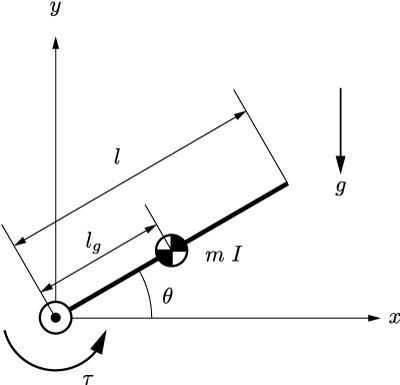

# 1リンクアームの動力学

ラグランジュの運動方程式を用いて，2次元平面に拘束された1リンクアームの運動方程式を求めてみる．

## 定義

<div align="center">
    
</div>

一様とは限らない剛体リンクが，ジョイントを介して慣性座標系の原点に固定されている．剛体振り子と考えても良い．

リンクの質量と長さは$m$, $l$とする．原点から質量中心までの距離を$l_{g}$とする．質量中心まわりの慣性モーメントを$I$とする．
リンクと$x$軸とがなす角度を$\theta$とする．
リンクの質量中心の位置を$(x, y)$とする．
ジョイントにはモーターが接続されていて，トルク$\tau$を発揮することができる．
$y$の負の向きに重力$g$がかかる．

## エネルギー関数の計算

系の運動エネルギーとポテンシャルエネルギーを求める．

まず運動エネルギー$T$を求めよう．
ここで，並進の運動エネルギーについてはデカルト座標を用いて書き下すのが簡便である．
$$
    T = \frac{m}{2}(\dot{x}^2 + \dot{y}^2) + \frac{I}{2}\dot{\theta}^2
$$
ここではまだジョイントによる拘束は考えていない．**リンクは独立なものとして運動エネルギーを求め，あとから拘束条件を考える**ことで思考を単純化することができる．

ジョイントによる拘束条件は以下のように書ける．
ジョイントは幾何的な拘束であり，これは位置の関係式で完全に表すことができるので，**ホロノミックな拘束**であるといえる．ホロノミック拘束は**独立な変数を減らし計算を簡単にしてくれる**ので，ありがたい条件である．
$$
    x = l_{g}\cos\theta\\
    y = l_{g}\sin\theta
$$
位置拘束条件の時間微分を行い，$\dot{x}$と$\dot{y}$を$\theta$と$\dot{\theta}$で表す．すなわち，
$$
    \dot{x} = -l_{g}\dot{\theta}\sin\theta\\
    \dot{y} =  l_{g}\dot{\theta}\cos\theta
$$
である．これを上記で求めた運動エネルギーに代入して，
$$
    T = \frac{m}{2}l_{g}^2\dot{\theta}^2 + \frac{I}{2}\dot{\theta}^2
    =\frac{1}{2}(I + m l_g^2)\dot{\theta}^2
$$
となる．
ホロノミック拘束によって，$x,y,\theta$の3つの座標を用いて表されていた系が$\theta$のみで表されるようになるということを覚えておこう．

```
この程度の運動エネルギーであれば，このような回りくどい考え方をせずにいきなり最後の形で書けるだろう．
今回は説明のため，今後応用しやすい形で計算を行っている．
```

次にポテンシャルエネルギー$U$を求めよう．$y=0$を重力ポテンシャルの原点として，
$$
    U = mgy = mgl_g\sin\theta
$$
となる．

これで，ラグランジアン$L$を求める準備はできた．
$$
    L = T- U = \frac{1}{2}(I + m l_g^2)\dot{\theta}^2 - mgl_g\sin\theta
$$

## 運動方程式を求める

ラグランジアンが導出できたので，微分操作を行い運動方程式を求める．
ラグランジュの運動方程式は
$$
    \frac{{\rm d}}{{\rm d}t}\left(\frac{\partial L}{\partial \dot{q}_i}\right) - \frac{\partial L}{\partial q_i} = Q_i
$$
である．ラグランジアンは一般化座標$\theta$のみを用いて表されているので，
$$
    \frac{{\rm d}}{{\rm d}t}\left(\frac{\partial L}{\partial \dot{\theta}}\right) = \frac{{\rm d}}{{\rm d}t}\left\lbrace(I + m l_g^2)\dot{\theta}\right\rbrace = (I + m l_g^2)\ddot{\theta}\\
    \frac{\partial L}{\partial \theta} = -mgl_g\cos\theta
$$
を得る．

次に一般化力について考える．
ジョイントは$\theta$を直接変化させるトルク$\tau$を発揮するので，今回は
$$
    Q = \tau
$$
である．座標変換の必要はなかった．

以上から，この系の運動方程式は
$$
    (I + m l_g^2)\ddot{\theta}+mgl_g\cos\theta = \tau
$$
となる．

## 得られた運動方程式の検証

上記で得られた運動方程式は本当に正しいのだろうか．
複雑な系ではこの問題に関して検証を行うことは難しい．
しかし，今回は非常に単純な系を用いているので，オイラーの運動方程式と比較して検証を行ってみよう．

ジョイント周りのモーメントの釣り合いを考えてオイラーの運動方程式を立式する．
まず，リンクのジョイント周りの慣性モーメント$I_O$は$I_O=(I + m l_g^2)$となることから，慣性力は
$$
    -I_O\ddot{\theta} = -(I + m l_g^2)\ddot{\theta}
$$
となる．
リンクにかかっている外力は，モータートルク$\tau$と重力である．
重力は質量中心にかかっていると考えて，その力が及ぼすトルクは
$$
    -mgl_g\cos\theta
$$
と表せる．
以上のトルクの(ダランベールの原理の意味で言う)釣り合いは，
$$
    -(I + m l_g^2)\ddot{\theta} -mgl_g\cos\theta + \tau = 0
$$
となる．これはラグランジュの運動方程式で求めたものと完全に一致している．

## まとめ

ラグランジュの運動方程式を用いると，思考を単純化し機械的に運動方程式を求めることができる．
はじめはできるだけ物理的な意味を考えず，淡々とすべてのエネルギーを書き出し，そのあとで拘束条件などを入れていくことがコツである．
この方法を用いれば，系がどれだけ複雑であっても，いつも同じような作業を行うことで運動方程式を得ることができる．

ただし，機械的に求める以上，出現したそれぞれの項がどのような物理的意味を持っているかは計算過程から明らかではない．
このようなことを知りたい場合は，系をよく観察し，各項がどのような意味を持っているのか，作業者自身が頭を使って考える必要がある．