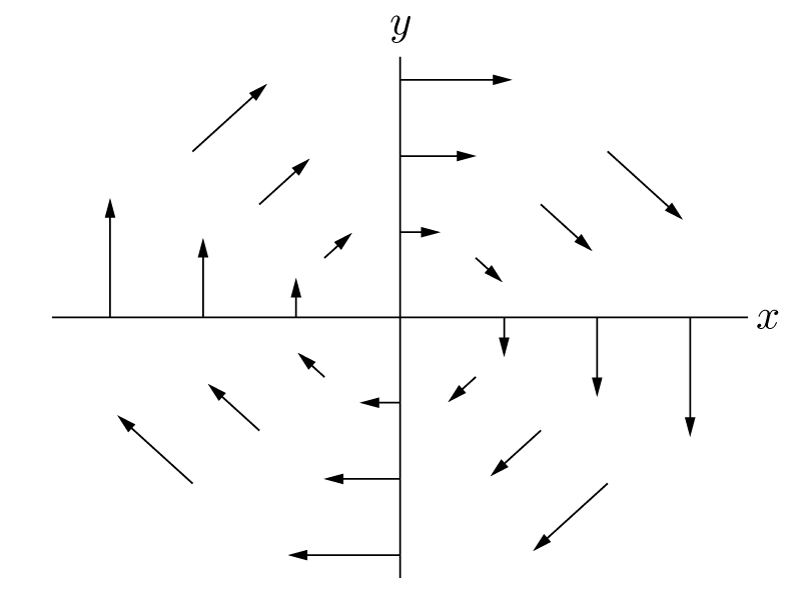
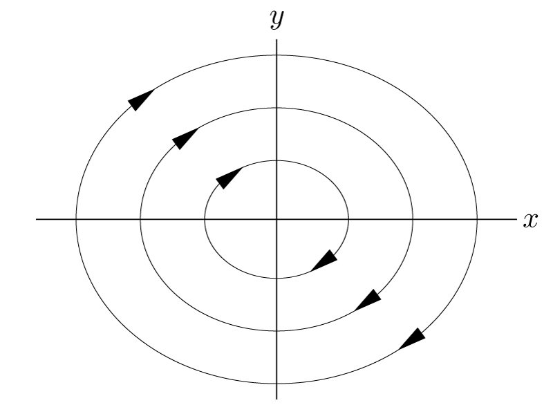

# 周期解とポアンカレ写像<!-- omit in toc -->

- [1. 運動方程式と状態空間](#1-運動方程式と状態空間)
  - [1.1. 一般化座標](#11-一般化座標)
  - [1.2. 運動方程式と状態量](#12-運動方程式と状態量)
  - [1.3. 状態空間における運動方程式](#13-状態空間における運動方程式)
  - [1.4. 1自由度系の運動](#14-1自由度系の運動)
- [2. ポアンカレ断面と周期解](#2-ポアンカレ断面と周期解)
  - [2.1. ポアンカレ写像の一般化](#21-ポアンカレ写像の一般化)
  - [2.2. 周期解の線型安定性](#22-周期解の線型安定性)
- [3. Reference](#3-reference)

## 1. 運動方程式と状態空間

### 1.1. 一般化座標

座標を用いると，ある時刻における**システム**（**系**）の状態を表すことができる．
座標はさまざまな取り方を選んでよい．例えば，3次元空間内にある質点の位置を表すのに，デカルト座標(Cartesian coordinates)を用いて3つのパラメータ$(x,y,z)$の組として表しても良いし，極座標(Polar coordinates)を用いて3つのパラメータ$(\theta_1, \theta_2, \theta_3)$を用いて表しても良い．

問題によっては，さらに拡張した座標を用いることもある．例えば，剛体の位置と姿勢を一意に表すためには，それぞれ3次元のパラメータが必要で，合計6個の座標が必要となる．よく用いられるのは，剛体の重心位置を表すパラメータ$(x,y,z)$と，剛体の姿勢を表すパラメータであるオイラー角$(\theta, \phi, \psi)$を組み合わせ，6個のパラメータ$(x,y,z,\theta, \phi, \psi)$によって剛体の位置・姿勢を一意に表す．

拘束を持つ系においては，その問題に適した座標を取ると考えやすくなる．例えば半径$r$の球面上の点の位置を表す座標は，3次元の座標$(x,y,z)$を用いて表して，$x^2+y^2+z^2=r^2$という拘束を別で考えることもできるが，緯度と経度を用いて表す方がより単純であることがわかるだろう．

上記のように，座標はデカルト座標にこだわらずとも，対象としている問題によって自由に取ってよい．いちいち座標に名前をつけるのも大変なので，このように自由に取られた座標のことを**一般化座標**と呼ぶ．

### 1.2. 運動方程式と状態量

ニュートンの第2法則は一般化座標$q(t)=[q_1(t), q_2(t), ..., q_n(t)]^\top$に対しても成立し，ラグランジアン$L$を用いて，
$$
\frac{d}{dt}\left(\frac{\partial L}{\partial \dot{q}}\right)-\frac{\partial L}{\partial q} = Q
$$
で表される．ここで$Q$は一般化座標から見た（保存力以外の）外力であり，一般化力と呼ばれる．

ラグランジュの運動方程式は，以下のような形に変換できる．
$$
M(q)\ddot{q}+h(q,\dot{q})+g(q) = Q
$$
ここで，$M(q)$は質量や慣性モーメントをまとめた慣性行列，$h(q,\dot{q})$は遠心力とコリオリ力，$g(q)$が保存力である．
ここからわかるのは，**ある時刻における運動は，一般化座標と速度を用いて一意に表せる**ということである．
一般化座標と速度を合わせて，**状態量**と呼ぶ．

### 1.3. 状態空間における運動方程式

状態量$q$と$\dot{q}$は独立変数である．（$\dot{q}$は$q$の時間微分であり，従属変数のように見えるが，実際にはそうではない．例えば任意の時刻において，質点の位置$x$を指定すると，速度$\dot{x}$が一意に決定してしまうのは不合理である．）
ここで新たに状態量ベクトル$z=[q^\top \dot{q}^\top]^\top$を定義する．
このとき，運動方程式は$z$とその時間微分を用いて
$$
\dot{z} = \begin{bmatrix}
\dot{q}\\
\ddot{q}
\end{bmatrix}
=\begin{bmatrix}
\dot{q}\\
M^{-1}(q)(Q-h(q,\dot{q})-g(q))
\end{bmatrix}
$$
と書き表すことができる．これが**状態空間**における運動方程式である．この形式では，$z$に関する1階微分の形で表されているので，数値計算等に便利である．

### 1.4. 1自由度系の運動

例として，1自由度系の運動を考えてみる．例えば$x$軸上で運動し外力を受けないバネマス系の運動方程式は
$$
m\ddot{x}+kx = 0
$$
と表される．ここで，$m$は質点の質量，$c$はダンパ係数，$k$はバネ定数である．
$y=\dot{x}$とおくと，この系の状態量は$z=[x\ y]^\top$で表され，運動方程式は
$$
\dot{z}=\begin{bmatrix}
    \dot{x}\\
    \dot{y}=\ddot{x}
\end{bmatrix}=\begin{bmatrix}
    y\\
    -\frac{k}{m}x
\end{bmatrix}
$$
と表される．

この運動を状態空間上にプロットしてみよう．すなわち，点$z$の運動を$x$-$y$平面にプロットする．
まず，平面上のさまざまな点$z$において，その点における速度$\dot{z}$を考える．
例えば$y$軸上（$x=0$）では
$$
\dot{z} = \begin{bmatrix}
    y\\
    0
\end{bmatrix}
$$
となり，速度ベクトルは$x$軸に並行になる．また，ベクトルの大きさは$y$に比例する．
$x$軸上（$y=0$）では，
$$
\dot{z} = \begin{bmatrix}
    0\\
    -\frac{k}{m}x
\end{bmatrix}
$$
となり，速度ベクトルは$y$軸に並行になる．また，$x$が大きいほど速度は大きくなる．
他の点も埋めていくと，図のように速度ベクトル$\dot{z}$を描くことができる．
このように，**運動方程式は，状態空間内にベクトル場を生成**する方程式であると捉えることもできる．

    

ある状態$z_0$を与えると，系は運動方程式に従って時間発展していく．これは状態空間内の点$z_0$が，ベクトル場に沿って流れていくことに対応する．
状態空間$x$-$y$内のさまざまな点$z$から出発し，ベクトル場に沿って移動していく様子を以下の図に示す．流れを示す曲線を**軌跡**と呼ぶ．バネマス系の運動は，$x$軸の運動を見ると単振動となるが，状態空間内では楕円を描くことがわかる．

    

## 2. ポアンカレ断面と周期解

例えばある関数$f(t)$が周期関数であるとき，任意の$t$に対して周期$T$を用いて以下が成立する．
$$
f(t+T) = f(t)
$$
バネマス系では運動が周期的である．周期$T$が経過する毎に，同じ状態量に戻ってくる．
数学者ポアンカレは周期性の問題に対して，全ての$t$について，$f(t)$と$f(t+T)$を比較する必要がないことを発見した．また，周期性を判断するために，時刻$t$に囚われる必要すらないことを示した．これが以下に示す**ポアンカレ断面**のアイデアである．

    

状態空間内に，軌跡と交差するように適当な線を引く．これをポアンカレ断面と呼ぶ．
ポアンカレ断面上のある点$z_n$から始まる軌跡が再びポアンカレ断面と交わる点を$z_{n+1}$とする．もし$z_{n+1} \neq z_n$なら，軌跡は周期的ではない．逆に，$z_{n+1} = z_n$なら，軌跡は周期的である．
これによって，軌跡の周期性を，軌跡上のある2点の関係で示すことが可能になった．

### 2.1. ポアンカレ写像の一般化

$N$次元空間内に，適当な$N-1$次元の超平面であるポアンカレ断面$S$を取る．（図は$N=3$としたときのイメージ図）

    

ポアンカレ断面上のある点$z_n$から始まる軌跡が再び$S$と交わる点を$z_{n+1}$とする．2点$z_n$と$z_{n+1}$の関係は，**ポアンカレ写像**$P$を用いて
$$
z_{n+1}=P(z_n)
$$
と表す．一般に，$P$を解析的に表すことは困難であり，数値計算などで近似的に求める．

周期的な軌跡（**周期解**）が存在するとき，軌跡はポアンカレ断面上の**固定点**$z^*$を通過し，
$$
z^* = P(z^*)
$$
が満たされる．

### 2.2. 周期解の線型安定性

周期解に摂動を加えたとき，その摂動がもとの周期解に収束すれば，その周期解は**安定**である．逆に，摂動が発散していけば，周期解は**不安定**である．上記の主張を数学的な表現に落とし込もう．

    

ポアンカレ断面上で固定点が存在するとき，これに摂動$v_0$を与える．この点から開始した軌跡が再びポアンカレ断面と交差する点は
$$
z^*+v_1 = P(z^* + v_0)
$$
と表せる．
$P$をテイラー展開すると，
$$
z^*+v_1 = P(z^*) + J(z^*) v_0 + O(||v_0||^2)
$$
となる．ここで，$J(z^*)$は$P$の$z^*$における**ヤコビ行列**（多次元に拡張した微分係数）である．
$ z^* = P(z^*)$であることと，$v_0$は微小なベクトルであることを考慮すると，
$$
 v_1 \approx J(z^*)v_0
$$
となる．ここから以下の定理が示される．

>【定理】
>$ J(z^*)$が持つ$N-1$個の固有値を$\lambda_1,...,\lambda_{N-1}$とする（**フロケ乗数**と呼ぶこともある）．
>全ての$j=1,2,..,N-1$について$|\lambda_j|<1$であれば，周期解は安定である．

【証明】
固有値に重複がない場合を考える．このとき，$J(z^*)$の固有ベクトル$e_j$からなる基底が存在し，なんらかのスカラー$c_j$を用いて
$$
v_0 = \sum_{j=1}^{N-1}c_j e_j
$$
と表せる．（この辺の議論の詳しいところは線形代数の適当な教科書を参照されたい）
このとき，
$$
v_1 = J(z^*)\sum_{j=1}^{N-1}c_j e_j = \sum_{j=1}^{N-1}c_j \lambda_j e_j
$$
となる．ポアンカレ断面を$k$回横断すると，
$$
v_k = \sum_{j=1}^{N-1}c_j (\lambda_j)^k e_j
$$
となる．全ての$j$に対して$|\lambda_j|<1$が成立しているならば，$k\rightarrow\infty$の極限で$v_k\rightarrow 0$となり，摂動は消えてなくなる．すなわち周期解は安定である．

## 3. Reference

1. ゴールドスタイン, 「古典力学　第3版」，吉岡書店．
2. ランダウ，シフシッツ，「力学　増訂第3版」，東京図書株式会社．
3. Lanczos, "The Variational Principles of Mechanics Fourth Edition," Dover Publication.
4. ストロガッツ，「非線形ダイナミクスとカオス」，丸善出版．
