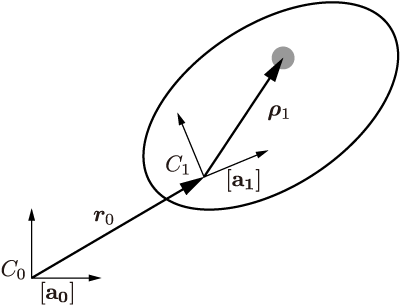

# 剛体の運動方程式

3次元空間内に配置された一つの剛体の運動方程式を求める．

## ポイント

* 剛体の状態量をどう表すか？
* ダランベールの原理から運動方程式を導く

## 運動学

慣性空間に固定され，原点が$C_0$の単位ベクトル系を$[{\bf a}_0]$とする．
同様に，剛体1に固定され，原点が剛体1の内部の点$C_1$の単位ベクトル系を$[{\bf a}_1]$とする．
任意のベクトル${\bm v}$は，それを座標$[{\bf a}_i]$から見た時の成分表示を
$$
{\bm v} = [{\bf a}_i]^\top v
$$
と表す．

|記号|意味 |
|--|--|
| $A_{10}$ | $[{\bf a}_{0}]$から$[{\bf a}_{1}]$への座標変換行列 |
|$\boldsymbol{\omega}_{10}=[{\bf a}_1]^\top\omega_{10}$|剛体1の慣性座標に対する角速度ベクトル|
|${\bm R}_1 = [{\bf a}_1]^\top R_1$|$C_1$から剛体1の質量中心までの距離ベクトル|
|${\boldsymbol{\rho}_1}=[{\bf a}_1]^\top \rho_1$|剛体1の質量中心から剛体1内の任意点への距離ベクトル|
|${\bm r}_0 = [{\bf a}_0]^\top r_0$|$C_0$から$C_1$までの距離ベクトル|

    

ベクトル${\bm f}_i = [{\bf a}_i]^\top f_i$のベクトル積${\bm f}\times$を，行列$\tilde{f}_i$を用いて$[{\bf a}_i]^\top \tilde{f}_i^\top$と表す．
$$
    f_i = \begin{bmatrix}
        f_{i1}\\
        f_{i2}\\
        f_{i3}
    \end{bmatrix}\quad
    \tilde{f}_i=\begin{bmatrix}
        0 & f_{i3} & -f_{i2}\\
        -f_{i3} & 0 & f_{i1}\\
        f_{i2} & -f_{i1} & 0
    \end{bmatrix}
$$
この標識を用いれば，外積の定義をいちいち覚えておく必要がないし，行列がかかってきても対応できる．

$C_0$から剛体1の任意の微小質量要素までの距離ベクトル$\bm{x}_1$とその速度$\bm{v}_1$は
$$
    {\bm x} = {\bm r}_0 + {\bm \rho}_1 = [{\bf a}_0]^\top r_0 + [{\bf a}_1]^\top \rho_1\\
    {\bm v} = [{\bf a}_0]^\top \dot{r}_0 + [{\bf a}_1]^\top \tilde{\omega}_{10}^\top \rho_1\\
    =[{\bf a}_0]^\top \dot{r}_0 + [{\bf a}_1]^\top \tilde{\rho}_1 {\omega}_{10}
$$
となる．ここで，$\tilde{\omega}_{10} = \dot{A}_{10}A_{10}^\top$である．
距離ベクトル${\bm x}_1$の仮想変位$\delta{\bm x}_1$は以下のように表せる．
$$
    \delta{\bm x}_1 = [{\bf a}_0]^\top \delta r_0 + [{\bf a}_1]^\top \tilde{\rho}_1 \delta{\Omega}_{10}
$$
ここで，$\delta{\Omega}_{10}$は単位ベクトル${\bf a}_{01}$, ${\bf a}_{02}$, ${\bf a}_{03}$軸のまわりの微小回転角である．

## 剛体の動力学方程式

剛体1の任意点周りの微小質量要素$d m_1$に関するニュートンの運動方程式は
$$
(\dot{\bm v}_1-{\bm f}_1)dm_1 = {\bm 0}
$$
ここで，${\bm f}_1$は質量要素$dm_1$に働く全ての力であり，外力と内力からなる．
仮想仕事を剛体1全体に対して和をとることで，ダランベールの原理を得る．
$$
    \int_1 \delta{\bm x}_1^\top(\dot{\bm v}_1-{\bm f}_1^{(e)})dm_1 = 0
$$
ただし，${\bm f}_1^{(e)}$は微小質量要素にかかる外力である．
内力${\bm f}_1^{(i)}$は剛体全体について積分を取るときに全て打ち消し合うことになるので，ここでは表式から省略している．

これを展開して，剛体1の運動方程式を求めてみよう．
まず，$d[{\bm a}_0]/dt = 0$, $d[{\bm a}_1]/dt = \dot{A}_{10}^\top[{\bm a}_0]$, $d\rho/dt = 0$を用いて
$$
\dot{{\bm v}}_1 = \frac{d}{dt}([{\bf a}_0]^\top \dot{r}_0 + [{\bf a}_1]^\top \tilde{\rho}_1 {\omega}_{10})\\
=[{\bf a}_0]^\top \ddot{r}_0 + [{\bf a}_0]^\top A_{10}^\top\rho + [{\bf a}_1]^\top \tilde{\rho}\dot{\omega}_{10}
$$
である．これをダランベールの原理に代入して
$$
\int_1 \delta{\bm x}_1^\top(\dot{\bm v}_1-{\bm f}_1^{(e)})dm_1\\
=\int_1 ([{\bf a}_0]^\top \delta r_0 + [{\bf a}_1]^\top \tilde{\rho}_1 \delta{\Omega}_{10})^\top([{\bf a}_0]^\top \ddot{r}_0 + [{\bf a}_0]^\top A_{10}^\top\rho + [{\bf a}_1]^\top \tilde{\rho}\dot{\omega}_{10}-[{\bm a}_1]f_1^{(e)})dm_1\\
=\int_1 \delta r_0^\top(\ddot{r}_0 + A_{10})
$$
