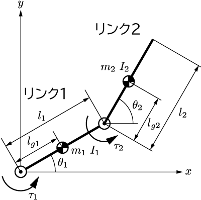

# 2リンクアームの動力学

ラグランジュの運動方程式を用いて，2次元平面に拘束された2リンクアームの運動方程式を求めてみる．

## 定義

    

一様とは限らない2つの剛体リンクが，ジョイントで接続されている．
リンク1はジョイントと反対側の端もジョイントとなっていて，慣性座標系の原点に固定されている．

リンク1の質量と長さは$m_1$, $l_1$とする．原点から質量中心までの距離を$l_{g1}$とする．質量中心まわりの慣性モーメントを$I_1$とする．
リンク2の質量と長さは$m_2$, $l_2$とする．ジョイントから質量中心までの距離を$l_{g2}$とする．質量中心まわりの慣性モーメントを$I_2$とする．

リンク1とリンク2が$x$軸となす角度をそれぞれ$\theta_1$，$\theta_2$とする．
リンク1とリンク2の質量中心の位置をそれぞれ$(x_1, y_1)$，$(x_2, y_2)$とする．
それぞれのジョイントにはモーターが接続されていて，トルク$\tau_1$と$\tau_2$を発揮することができる．
$y$の負の向きに重力$g$がかかる．

## ラグランジアンの計算

系の運動エネルギーとポテンシャルエネルギーから，系のラグランジアンを求める．

エネルギーを考えるときはまず，座標系としてデカルト座標を用いて書き下すのが簡便である．
それぞれのリンクについて運動エネルギーを求めると，
$$
    T_1 = \frac{m_1}{2}(\dot{x}_1^2 + \dot{y}_1^2) + \frac{I_1}{2}\dot{\theta}_1^2\\
    T_2 = \frac{m_2}{2}(\dot{x}_2^2 + \dot{y}_2^2) + \frac{I_2}{2}\dot{\theta}_2^2
$$
それぞれのリンクのポテンシャルエネルギーを考えると，
$$
    U_1 = m_1 g y_1\\
    U_2 = m_2 g y_2
$$
となる．
ここではまだジョイントによる拘束は考えていない．**それぞれのリンクは独立なものとして運動エネルギーを求め，あとから拘束条件を考える**ことで思考を単純化することができる．

ジョイントによる拘束条件は以下のように書ける．
ジョイントは幾何的な拘束であり，位置の関係式で完全に表すことができるので，ホロノミックな拘束であるといえる．ホロノミック拘束は計算が簡単になるので，ありがたい条件である．
$$
    x_1 = l_{g1}\cos\theta_1\\
    y_1 = l_{g2}\sin\theta_1
$$
$$
    x_2 = l_1\cos\theta_1 + l_{g2}\cos\theta_2\\
    y_2 = l_1\sin\theta_1 + l_{g2}\sin\theta_2
$$
位置拘束条件の時間微分を行い，$\dot{x}_i$と$\dot{y}_i$を$\theta_i$と$\dot{\theta}_i$で表す．すなわち，
$$
    \dot{x}_1 = -l_{g1}\dot{\theta}_1\sin\theta_1\\
    \dot{y}_1 = l_{g2}\dot{\theta}_1\cos\theta_1
$$
$$
    \dot{x}_2 = -l_1\dot{\theta}_1\sin\theta_1 - l_{g2}\dot{\theta}_2\sin\theta_2\\
    \dot{y}_2 = l_1\dot{\theta}_1\cos\theta_1 + l_{g2}\dot{\theta}_2\cos\theta_2
$$
である．
これらの関係式によって，$x_1, y_1, \dot{x}_1, \dot{y}_1$, $x_2, y_2, \dot{x}_2, \dot{y}_2$は$\theta_1, \theta_2, \dot{\theta}_1, \dot{\theta}_2$の従属変数として表せることになった．
すなわち，この系を表すためには，一般化座標として$\theta_1$と$\theta_2$だけを考えれば良いということである．
上記の関係式をエネルギー関数に代入すると，
$$
T_1 = \frac{1}{2}(I_1 + m_1l_{g1}^2)\dot{\theta}_1^2\\
T_2 = \frac{II_2}{2}\dot{\theta}_2^2 + \frac{m_2}{2} \left\lbrace{{\left(l_1 \dot{\theta}_1 \sin\theta_1+l_{g2} \dot{\theta}_2 \sin\theta_2 \right)}}^2 +{{\left(l_1 \dot{\theta}_1 \,\cos\theta_1+l_{g2} \,\dot{\theta}_2 \cos\theta_2 \right)}}^2 \right\rbrace\\
U_1 = m_1 g l_{g1} \sin\theta_1\\
U_2 = m_1 g l_{1} \sin\theta_1 + m_2 g l_{2} \sin\theta_2\\
$$
となる．
ラグランジアン$L$は，
$$
L= T_1 + T_2 - U_1 - U_2
$$
で得られる．

## 運動方程式の導出

ラグランジアンが得られたら，あとはこれらをラグランジュの運動方程式に代入すればよい．ここで，一般化外力を求める必要があるが，今回は一般化座標$\theta_1$, $\theta_2$に直接モータートルク$\tau_1$, $\tau_2$がそれぞれかかっているので，これらが一般化外力となる．
すなわち，運動方程式は
$$
\frac{{\rm d}}{{\rm d}t}\left(\frac{\partial L}{\partial \dot{\theta}_1} \right) - \frac{\partial L}{\partial \theta_1} = \tau_1\\
\frac{{\rm d}}{{\rm d}t}\left(\frac{\partial L}{\partial \dot{\theta}_2} \right) - \frac{\partial L}{\partial \theta_2} = \tau_2
$$
から得られる．

この計算は非常に大変であり，まとめるのも骨が折れるので，ここには結果を記載しない．その代わりに，MATLABやMAPLEのシンボリック計算によって上記の計算を実行する方法を次回の記事で解説する．